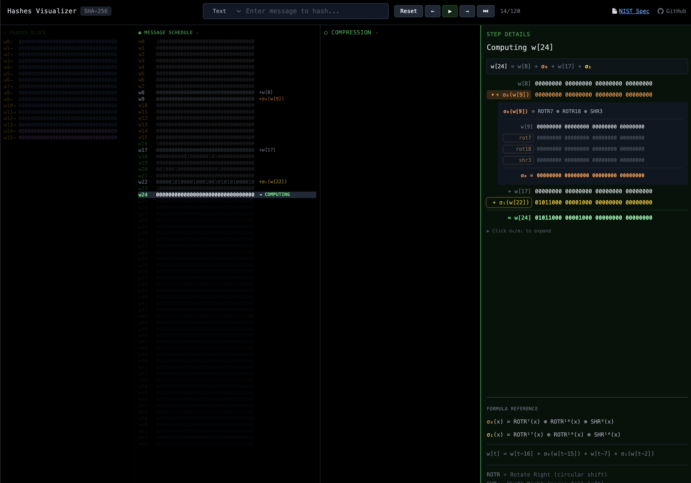

# SHA-256 Visualizer



**An animated, step-by-step visualizer for SHA-256.**

🔗 **Try it:** [hashexplained.com](https://hashexplained.com)

---

A tool that lets you watch SHA-256 execute in real-time. Every phase is animated:

- Padding
- Message schedule
- 64 compression rounds
- Final hash

Step forward, step back, autoplay, or jump to any phase. Everything shown in actual binary.

Most SHA-256 resources are either dense specs or vague overviews. This tool lets you actually *see* the bits move:

- Rotations that visually wrap around
- XOR operations combining values bit by bit
- State updates showing what changes each round vs. what just shifts

**Limitations:** Currently supports messages up to 55 characters (single block) and SHA-256 only. Multi-block hashing and other algorithms (SHA-1, SHA-512, RIPEMD-160, etc.) can be added if there's interest.

**Reference:** [NIST FIPS 180-4: Secure Hash Standard](https://nvlpubs.nist.gov/nistpubs/FIPS/NIST.FIPS.180-4.pdf)

---

## Run Locally

```bash
npm install
npm start
```

---

MIT License | [GitHub](https://github.com/bitcoin-dev-project/hashes-visualizer) | Built by [Bitcoin Dev Project](https://github.com/bitcoin-dev-project)
